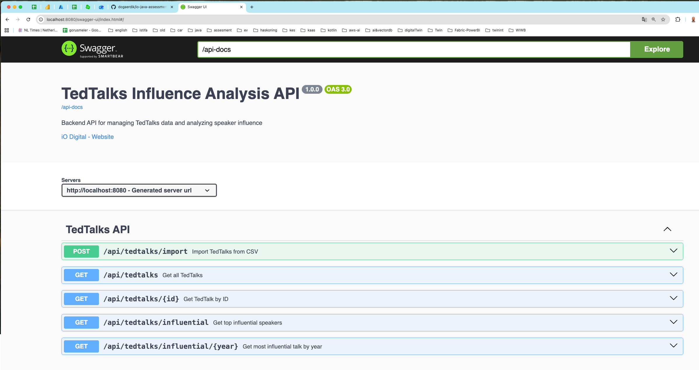

# TedTalks Influence Analysis

Backend system for managing TedTalks data and analyzing speaker influence. This project is built with Java 17, Spring Boot 3.2, and PostgreSQL.

## Features

- **Data Management**: CRUD operations for TedTalks
- **CSV Import**: Import TedTalks data from CSV file
- **Influence Analysis**: Identify influential speakers based on views and likes
- **REST API**: RESTful endpoints for all operations
- **Swagger UI**: Interactive API documentation
- **Docker Support**: PostgreSQL database in Docker container

## Technology Stack

- Java 17
- Spring Boot 3.2.0
- Spring Data JPA
- PostgreSQL 15
- Flyway (Database migrations)
- OpenCSV (CSV parsing)
- Swagger/OpenAPI 3
- Maven

## Prerequisites

- Java 17 or higher
- Maven 3.6+
- Docker and Docker Compose

## Setup Instructions

### 1. Clone the repository

```bash
git clone https://github.com/dogaerdik/io-assessment-tedtalks
```

### 2. Start PostgreSQL database

```bash
docker-compose up -d
```

This will start a PostgreSQL container on port 5432 with the following credentials:
- Database: `tedtalksdb`
- Username: `tedtalks_user`
- Password: `tedtalks_pass`

### 3. Build and run the application

```bash
mvn clean install
mvn spring-boot:run
```

The application will start on `http://localhost:8080`

### 4. Import data

After the application starts, import the CSV data:

```bash
curl -X POST http://localhost:8080/api/tedtalks/import
```

Or use Swagger UI at `http://localhost:8080/swagger-ui.html`

## API Endpoints

### Swagger UI

```
http://localhost:8080/swagger-ui.html
```



### Base URL
```
http://localhost:8080/api/tedtalks
```

### Available Endpoints

- `GET /api/tedtalks` - Get all TedTalks
- `GET /api/tedtalks/{id}` - Get TedTalk by ID
- `POST /api/tedtalks/import` - Import TedTalks from CSV
- `GET /api/tedtalks/influential` - Get top 10 influential speakers
- `GET /api/tedtalks/influential/{year}` - Get most influential talk by year


## Influence Score Calculation

The influence score is calculated using the formula:
```
influenceScore = views + (likes * 100)
```

For speaker influence, the total influence score of all talks by a speaker is calculated.

## Running Tests

```bash
mvn test
```

## Configuration

The following properties can be configured in `application.properties`:

- `app.csv.file.path`: Path to the CSV file (default: `data/iO Data - Java assessment.csv`)
- `app.influence.top.speakers.limit`: Number of top speakers to return (default: `10`)

## Database Schema

The `tedtalks` table includes the following fields:
- `id`: Primary key
- `title`: Talk title
- `author`: Speaker name
- `date`: Talk date (year and month)
- `views`: Number of views
- `likes`: Number of likes
- `link`: Unique talk URL
- `created_at`: Timestamp when record was created (auto-managed by JPA Auditing)
- `updated_at`: Timestamp when record was last updated (auto-managed by JPA Auditing)

## Assumptions and Decisions

1. **Influence Algorithm**: Uses `views + (likes * 100)` to balance reach and engagement
2. **Date Format**: CSV dates (e.g., "December 2021") are parsed to `LocalDate` with day set to 1
3. **Duplicate Handling**: Duplicate talks (based on link) are skipped during import
4. **Speaker Influence**: Calculated as the sum of all talk influence scores by a speaker
5. **Top Speakers**: Returns top 10 speakers by default
6. **Database**: PostgreSQL with Flyway for schema management

## Example API Responses

### Get All TedTalks
```json
[
  {
    "id": 1,
    "title": "Climate action needs new frontline leadership",
    "author": "Ozawa Bineshi Albert",
    "date": "2021-12-01",
    "views": 404000,
    "likes": 12000,
    "link": "https://ted.com/talks/...",
    "influenceScore": 1604000
  }
]
```

### Get Top Influential Speakers
```json
[
  {
    "author": "Speaker Name",
    "totalInfluenceScore": 5000000,
    "talkCount": 5
  }
]
```

## CI/CD

GitHub Actions workflow runs tests on every commit to main/master/develop branches.

